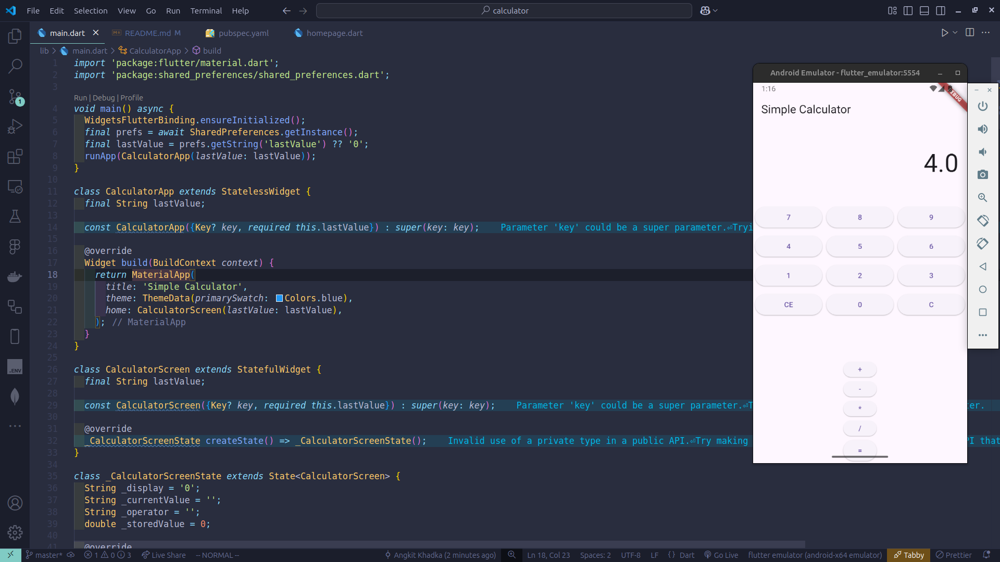

# Calculator

a simple calculator, created to learn flutter.

## How Does This Work?

This Flutter application has one main functionality:
Calculate:)

## Key Files

main.dart: The core file that includes the build function to render the whole app
calculator_screen.dart: This is the component displyed on the homepage

pubspec.yaml: Lists dependencies

images/image.png: A preview of how the homepage looks.

## Source & Modifications

The original project was only a bare minimum flutter project, I added calculator functionalitites

## Why These Changes?

The changes are made to make the calculator work:)
